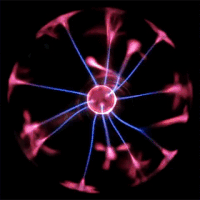
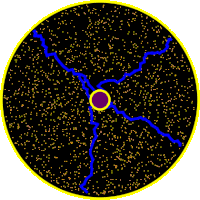

# PlasmaBall
A simple program designed to simulate a plasma globe.

Real plasma globe           |  Simulated plasma globe
:-------------------------:|:-------------------------:
  |  

## GUI

The GUI is shown below.
 

## How to run

### Qt Creator
Start by installing the Qt5 SDK from [qt.io](https://www.qt.io/download). 
To build this projects, open the [`PlasmaSim1.pro`](source/PlasmaSim1.pro) file with Qt Creator. Inside Qt Creator, you can first build the project, after which you can run the program.
